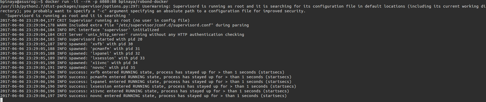
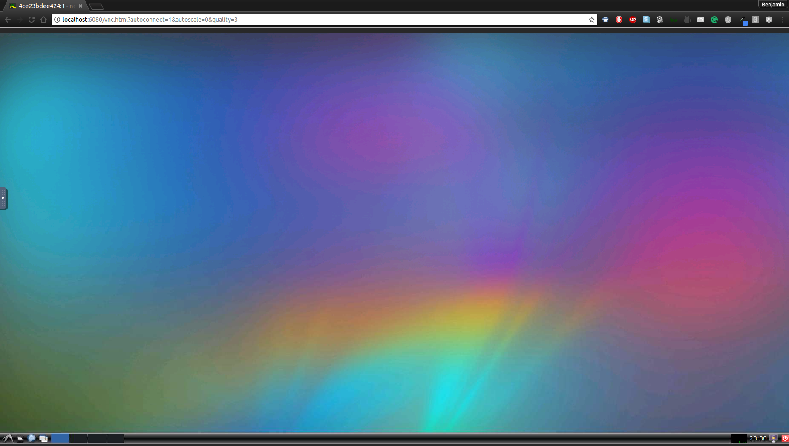

# ROS Melodic - VNC-enabled Docker container
Docker container featuring a full ROS Melodic Ubuntu Bionic installation. Quick and easy way to set up ROS in an isolated environment, with convenient HTML5 and VNC to access the desktop environment. Heavily based on [bpinaya's project](https://github.com/bpinaya/robond-docker).

## Setup
You'll need to install Docker in your computer, if you've used Docker before this step should be straightforward, otherwise check [this link](https://www.docker.com/what-docker) for more information about it.
  - Installation's instructions for Ubuntu can be found [HERE](https://docs.docker.com/engine/installation/linux/ubuntu/)
  - Installation's instructions for Windows can be found [HERE](https://docs.docker.com/docker-for-windows/install/)
  - Installation's instructions for MacOS can be found [HERE](https://docs.docker.com/docker-for-mac/install/)

In some Linux distros (e.g. Ubuntu) you need to run `docker` with admin privileges. You can hide this by setting an alias
```
echo "alias docker='sudo docker'" >> ~/.bash_aliases
```

or

```
sudo addgroup --system docker
sudo adduser $USER docker
newgrp docker

```

## Running the container

After having installed Docker, you can pull the image and run the container with
```
docker run -it --rm fbottarel/ros-desktop-full-vnc
```
This will pull the image from the repo and start it as a container. You will be logged as root in the container console and will see some debug messages.





For a quick sanity check, you can run in another terminal

```
docker exec -it `docker ps -l -q` bash
```
This will open a terminal console in the container, letting you type in whatever command you might need. Try launching `roscore` or any command you would expect to work in a ROS installation. If the ros master spins up, everything seems in order.

## Using your container
You can make use of the HTML5 interface by launching the container with a specific port
```
docker run -it --rm -p 6080:80 fbottarel/ros-desktop-full-vnc
```
and then you can access to it by navigating to
```
localhost:6080
```
or
```
127.0.0.1:6080
```
in any browser window. You should see your desktop like this:




If you want to use a VNC client (Like [RealVNC](https://www.realvnc.com/download/viewer/)), go with
```
docker run -it --rm -p 6080:80 -p 5900:5900 fbottarel/ros-desktop-full-vnc
```
Then open it in your VNC viewer with the port 5900.

## Share files with the container

The image comes with a catkin workspace already set up in `/home/ubuntu/ros_wsp`. You can write and pull packages in the container, however __keep in mind that any change will be gone when you kill the container__. Make sure to push your changes (either with `docker commit`, or on any external software repo e.g. github) before you kill the container.

A fast and easy way to retain any change in your catkin workspace is to mount it as a volume in the host operating system. For instance, let's say you use Ubuntu and your catkin workspace is in `/home/fbottarel/catkin_ws`, you can run the container with the following command

```
docker run -it --rm -p 6080:80 -p 5900:5900 -v /home/fbottarel/catkin_ws:/home/ubuntu/ros_ws /fbottarel/ros-desktop-full-vnc
```

You can populate the directory as you wish from the host system, and the packages will show up in the container workspace (and vice versa!).

## Acknowledgements

 - This image is based on [FCWU image](https://github.com/fcwu/docker-ubuntu-vnc-desktop) , that has the support for the VNC server with browser support, so no VNC client is needed, kudos to him!
- Part of the readme and the images come from [bpinaya](https://github.com/bpinaya/robond-docker)'s project. Equal kudos must be delivered there :P
